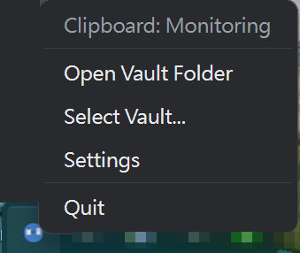
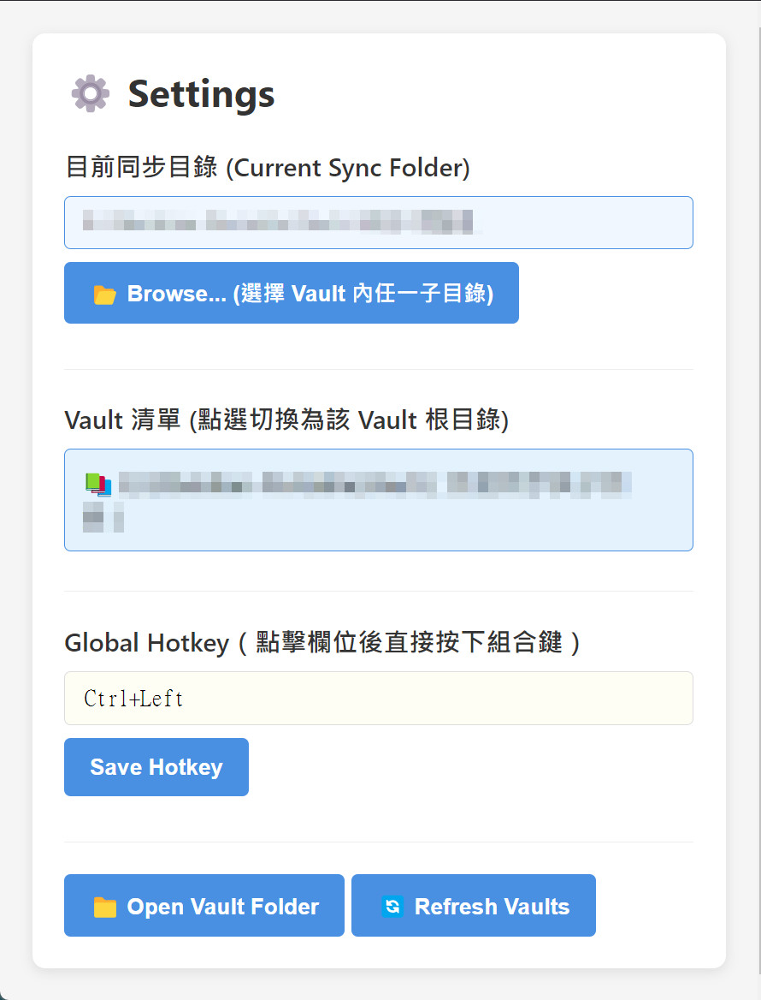

# Clipboard Vault Sync

[](https://github.com/fifthadj/clipboard-vault-sync/actions/workflows/test.yml)
[](./LICENSE)

English | [繁體中文](#繁體中文說明)

Copy anything, keep it forever. A tiny **system-tray app** that watches your clipboard and saves everything you copy — text **and images** — straight into your [Obsidian](https://obsidian.md) vault as Markdown notes.

The key difference from Obsidian clipboard plugins: **Obsidian doesn't need to be open.** Plugins only capture while the app is running; this sits in your tray and captures everything, all day, then your notes are just *there* next time you open your vault.

- 📋 **Auto-capture** — polls the system clipboard (500 ms); every new copy becomes a timestamped note
- 🖼️ **Images too** — screenshots and copied images are converted to **AVIF** (bundled `avifenc`, quality 80; falls back to PNG if conversion fails — images are never lost) and linked from the note
- 🔔 **Save feedback** — a toast notification confirms every save; pressing the hotkey also tells you when content was a duplicate or the clipboard was empty
- 🔁 **Continuous mode toggle** — tray checkbox: on = auto-save every new copy (default), off = save only via hotkey
- 🌐 **Multilingual UI** — English and Traditional Chinese (繁體中文); follows your system language, switchable in Settings
- 🧠 **Deduplication** — the same content is never saved twice, even across app restarts (content-hash history)
- 🚫 **No startup spam** — whatever was already in your clipboard when the app starts is not saved
- 📁 **Sync to any folder in your vault** — pick the vault root or any subfolder (e.g. your inbox) as the target
- ⌨️ **Global hotkey** — `Ctrl+Alt+C` by default; press-to-record hotkey picker in Settings
- 🔒 **Local only** — no network, no telemetry, nothing leaves your machine. It's open source; check for yourself.

> ⚠️ **Honest note — this saves *everything* you copy**, including passwords and other sensitive text, into plain-text Markdown files in your vault. Quit the app from the tray before copying secrets, or delete the note afterwards. A pause toggle and pattern-based filtering are on the roadmap.

## Screenshots

| Tray menu | Settings |
|:---:|:---:|
|  |  |
| Lives in your system tray | Pick any folder inside a vault; press-to-record hotkey |

## Install

Grab the portable `.exe` (no install needed) or the installer from [Releases](https://github.com/fifthadj/clipboard-vault-sync/releases).

Or build from source:

```sh
git clone https://github.com/fifthadj/clipboard-vault-sync.git
cd clipboard-vault-sync
npm install
npm run build
npm start        # or: npm run dist  → portable exe + installer in release/
```

## Usage

1. Launch — an icon appears in the system tray (no window)
2. Right-click the tray icon → **Select Vault…** and pick any folder *inside* an Obsidian vault (it validates by looking for a `.obsidian` ancestor)
3. Copy things. Each copy becomes a note in the selected folder:

```
Clipboard-2026-07-02_14-30-25-123.md      ← one file per clipboard entry
attachments/clipboard_143025.123456.avif  ← images, auto-created subfolder
```

Note format:

```markdown
# Clipboard

## [14:30:25.123] Clipboard Entry
The text you copied


---
```

### Settings (tray → Settings)

| Setting | What it does |
|---|---|
| Current sync folder | Shows the exact target path (full path, including subfolders) |
| Browse… | Pick a different folder inside any vault |
| Vault list | Auto-discovered vaults (`~/Obsidian`, `Documents/Obsidian`, all drive roots on Windows); click to switch |
| Global hotkey | Click the field, press your combo, save |

Config lives in `%APPDATA%/clipboard-vault-sync/config.json` (`vaultSearchPaths` there adds custom scan locations). Dedup history is `seen-hashes.json` next to it — delete it to allow re-saving everything.

## Platform support

**Windows** is what I use and test. The code is plain Electron APIs with no Windows-specific calls, so macOS/Linux likely work (`npm start`), but are untested — reports and PRs welcome. Known caveats: Wayland restricts background clipboard reading and global shortcuts; macOS tray wants a template icon.

## Development

```sh
npm test         # jest — unit tests for the monitor (dedup, priming) and vault writer
npm run dev      # tsc --watch + electron
npm run dist     # package (output in release/, NOT dist/ — dist/ is compiled JS)
```

Stop any running instance before `npm run dist`, or overwriting `release/` fails with `EBUSY` while files are in use.

AVIF encoding uses a bundled `avifenc.exe` ([libavif](https://github.com/AOMediaCodec/libavif) official static build) at `assets/bin/`, spawned as a child process — no native Node modules involved.

## License

[MIT](./LICENSE)

---

## 繁體中文說明

**複製即存,永久保留。** 一個小巧的**系統匣常駐程式**,監看你的剪貼簿,把你複製的所有東西——文字**和圖片**——直接以 Markdown 筆記存進 [Obsidian](https://obsidian.md) vault。

和 Obsidian 剪貼簿 plugin 的關鍵差異:**不需要開著 Obsidian**。Plugin 只有在 Obsidian 執行時才能收集;這個 app 常駐系統匣,整天默默收集,下次打開 vault 筆記就已經在那裡了。

- 📋 **自動收集** — 每 500ms 輪詢系統剪貼簿,每次複製自動存成一則帶時間戳的筆記
- 🖼️ **圖片也收** — 截圖與複製的圖片自動轉 **AVIF**(內附 avifenc,品質 80;轉檔失敗自動退存 PNG,圖片絕不丟失)並在筆記中產生連結
- 🔔 **存檔提示** — 每次存檔跳出通知確認;按熱鍵時就算內容重複或剪貼簿是空的也會告知
- 🔁 **連續收集模式開關** — 托盤勾選:開=每次複製自動存(預設),關=只有按熱鍵才存
- 🌐 **多語系介面** — 繁體中文與 English;預設跟隨系統語言,可在設定中切換
- 🧠 **去重** — 相同內容永遠只存一次,**跨 app 重啟依然有效**(內容 hash 歷史)
- 🚫 **啟動不誤存** — app 啟動前已在剪貼簿的內容不會被存入
- 📁 **可同步到 vault 內任一資料夾** — 選 vault 根目錄或任何子資料夾(例如你的 inbox)
- ⌨️ **全域快捷鍵** — 預設 `Ctrl+Alt+C`;Settings 內點欄位直接按組合鍵即可錄製
- 🔒 **純本地** — 無網路、無遙測,任何資料都不離開你的電腦。開源,歡迎查驗。

> ⚠️ **誠實提醒——它會存下你複製的*所有*東西**,包括密碼等敏感文字,以純文字 Markdown 存在 vault 裡。複製機密前請先從托盤 Quit,或事後刪除該筆記。暫停開關與敏感內容過濾在 roadmap 上。

### 安裝

到 [Releases](https://github.com/fifthadj/clipboard-vault-sync/releases) 下載 portable `.exe`(免安裝)或安裝檔;或從原始碼建置:

```sh
git clone https://github.com/fifthadj/clipboard-vault-sync.git
cd clipboard-vault-sync
npm install
npm run build
npm start        # 或 npm run dist → release/ 產出 portable exe 與安裝檔
```

### 使用

1. 啟動後系統匣出現圖示(沒有視窗)
2. 右鍵托盤圖示 → **Select Vault…** 選擇 Obsidian vault *內*的任一資料夾(以 `.obsidian` 上層目錄驗證)
3. 開始複製。每筆複製會在選定資料夾產生:

```
Clipboard-2026-07-02_14-30-25-123.md      ← 每筆剪貼一檔
attachments/clipboard_143025.123456.avif  ← 圖片(自動建立子資料夾)
```

### 設定(托盤 → Settings)

| 設定 | 說明 |
|---|---|
| 目前同步目錄 | 顯示完整目標路徑(含子資料夾) |
| Browse… | 改選任一 vault 內的資料夾 |
| Vault 清單 | 自動掃描到的 vault(`~/Obsidian`、`Documents/Obsidian`、Windows 各磁碟根目錄),點選切換 |
| Global Hotkey | 點欄位、按下組合鍵、儲存 |

設定檔在 `%APPDATA%/clipboard-vault-sync/config.json`(`vaultSearchPaths` 可加自訂掃描位置)。去重歷史在旁邊的 `seen-hashes.json`——刪掉即可讓所有內容重新可存。

### 平台支援

**Windows** 是作者實際使用與測試的平台。程式碼只用跨平台 Electron API,macOS/Linux 理論可跑(`npm start`)但未經測試——歡迎回報與 PR。已知注意事項:Wayland 會限制背景讀剪貼簿與全域快捷鍵;macOS 托盤需要 template icon。
